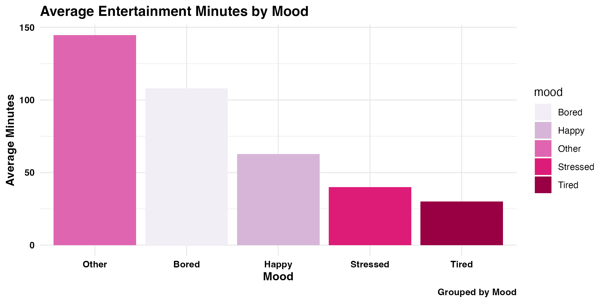
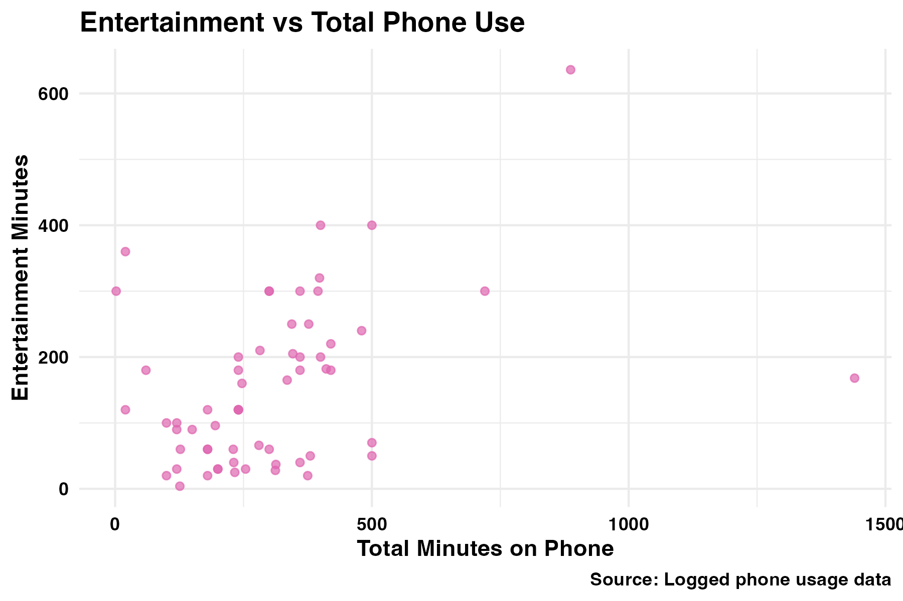
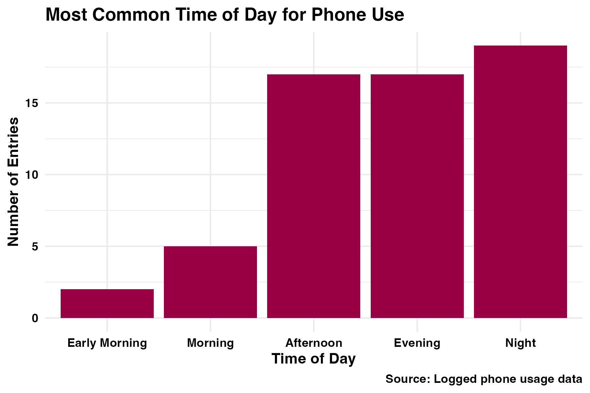
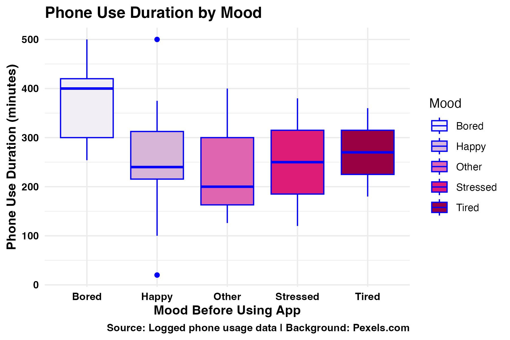
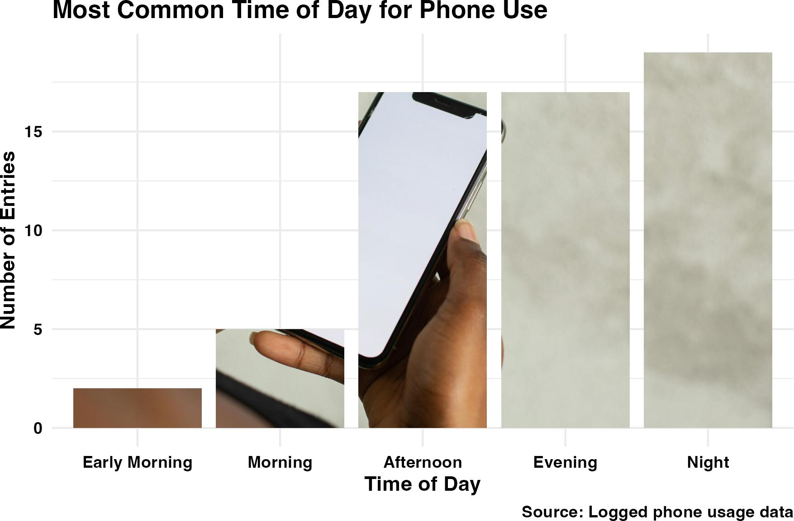
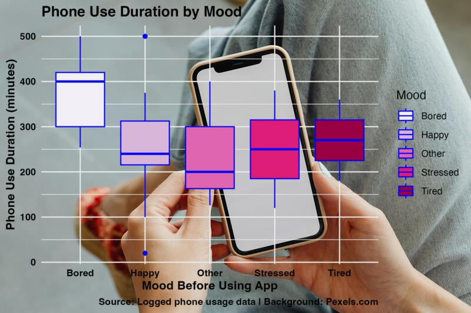

<script src="https://code.jquery.com/jquery-3.7.1.min.js" integrity="sha256-/JqT3SQfawRcv/BIHPThkBvs0OEvtFFmqPF/lYI/Cxo=" crossorigin="anonymous"></script>

```{r setup, include=FALSE}
knitr::opts_chunk$set(echo=FALSE, message=FALSE, warning=FALSE, error=FALSE)
```

```{js}
$(function() {
  $(".level2").css('visibility', 'hidden');
  $(".level2").first().css('visibility', 'visible');
  $(".container-fluid").height($(".container-fluid").height() + 300);
  $(window).on('scroll', function() {
    $('h2').each(function() {
      var h2Top = $(this).offset().top - $(window).scrollTop();
      var windowHeight = $(window).height();
      if (h2Top >= 0 && h2Top <= windowHeight / 2) {
        $(this).parent('div').css('visibility', 'visible');
      } else if (h2Top > windowHeight / 2) {
        $(this).parent('div').css('visibility', 'hidden');
      }
    });
  });
})
```

```{css echo=FALSE}
h1 {
  color: #fafafc;
  font-family: 'Futura', sans-serif;
  font-weight: bold;
  background-color: #0f0f42;
  padding: 20px;
}

h2 {
  color: #fafafc;
  font-family: 'PT Sans', sans-serif;
  background-color: #0f0f42;
  font-weight: bold;
  padding: 20px;
  border-bottom: 3px solid #4f87db;
}

body {
  font-family: 'PT Sans', sans-serif;
  background: linear-gradient(135deg, #b3d1ff, #d1deeb);
  font-size: 18px;
  line-height: 1.6;
  letter-spacing: 0.5px;
  color: #333;
}

a {
  color: #0f0f42;
  text-decoration: none;
  transition: color 0.3s ease;
}


img {
  border: 5px solid #0f0f42;
  border-radius: 10px;
  margin: 20px 0;
}


ul {
  list-style-type: square;
}
```

## Introduction

This story explores patterns in how I use my phone, based on observational data I collected using a Google Form. The data was logged across various contexts and moods throughout my daily life, helping me investigate how and why I reach for my phone.


## Mood Before Using the Phone

{alt="Bar chart of mood before using phone"}

This bar plot shows the average number of entertainment minutes logged per mood (e.g., bored, stressed). It was grouped by both mood and weekday, using group_by() and summarised with mean(). We also used lubridate::wday() to extract the weekday from the timestamp, giving more temporal context.

To clean inconsistent text formatting, I used stringr::str_to_title() to capitalise mood responses like "bored" into "Bored".

"Other" and "Bored" moods had the highest average entertainment times. This shows that when I’m unmotivated or disengaged, I’m more likely to spend longer on my phone for entertainment.


## Entertainment vs Total Use

{alt="Scatterplot comparing entertainment use and total use"}

This scatter plot shows that as total phone use increases, entertainment use tends to increase as well. Most entries fall below 400 minutes for total mintues, with entertainment minutes commonly ranging between 100 and 300. A few outliers indicate very high total phone usage, suggesting occasional heavy-use days.

## Peak Phone Use Time

{alt="Bar chart of time-of-day phone use"}

This bar chart shows the times of day when phone use was most frequent. Most entries were logged in the afternoon, evening, and night, indicating a clear preference for phone use later in the day. Fewer entries were recorded in the early morning and morning. This distribution reflects typical daily routines, where phone engagement increases after midday.

## Phone Use Duration by Mood

{alt="Boxplot showing phone use by mood"}

This boxplot displays the distribution of total phone use minutes across different moods. I used geom_boxplot() to visualise how usage varied depending on mood. The chart shows that "Bored" and "Tired" moods tend to be associated with higher and more variable screen time. This suggests that emotional states may influence how long I spend on my phone, particularly when feeling low-energy or unengaged.


## Bonus Creative Visualisation 

{alt="Creative cutting visual using shape cuttings"}
{alt="Creative cutting visual using shape cuttings"}

In two of my plots, I used creative enhancements to elevate storytelling:

creative_plot3.png:  I used the {cuttingshapes} package to fill each bar of the “Most Common Time of Day for Phone Use” chart with a real-world image of someone using a phone. Each bar is filled with a portion of the photo, making the visual more immersive and clearly linking the theme of device use with the concept of daily routines.

creative_plot4.png: I used the {magick} package to overlay my box plot of phone use by mood onto a realistic background image of a person holding a phone. The vibrant colors of the plot stand out well against the image, and this visual metaphor reinforces how our moods affect our device engagement..

These enhancements not only made the visuals more engaging, but they also aligned thematically with the data story—making the connection between mood, time of day, and phone usage more relatable.


## Conclusion

This story helped me discover that my mood and time of day significantly influence my phone use. When I feel bored or tired, I tend to spend much longer on entertainment apps. Evenings are clearly the most common time I use my phone, and there’s a strong relationship between my overall usage and entertainment consumption.

It was interesting to see that although I rarely use my phone early in the morning, the time I do spend later in the day increases substantially. Visually exploring my data made it easier to identify when I tend to be more distracted and how mood drives my screen time.


## GitHub Link
You can view the HTML visual data story on GitHub **[here](https://keerur.github.io/stats220/visual_data_story.html).**


```{r file='data_visualisation.R', eval=FALSE, echo=TRUE}

```
